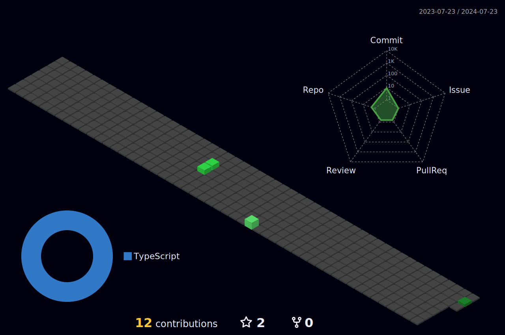

<h1 align="center">Mr Mysterius' GitHub Page</h1>

  
  **Hi**, I am a **Friendly Hobby Coder**, that does most of the **stuff for fun**, so my code might **not** be **optimal** all the time, but thats **okay for me**.
  
  Also **while you're here** why don't you **check out** some of my **pinned reposetories** or hit me up with a **message**, if you like something or you have some feedback.
  

  

  
  

  

---

  
  [ @MrMysterius666](https://twitter.com/MrMysterius666) - [ @Mr Mysterius#0020](https://discord.nohobbysfound.net) - [ u/MrMysterius](https://www.reddit.com/user/MrMysterius)

